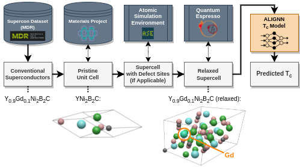
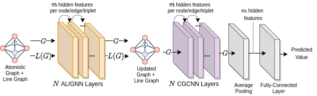

# superconductors-gnn
A Jupyter Notebook Repository for the paper "Predicting Critical Temperature of Doped and Alloyed Superconductors with Graph Convolutional Neural Networks".

## Overview

(To be added soon)






## Getting Started

### Running with Python3
To run this project with Python3, you will need to install the required dependencies. It is recommended that you do this inside of a [Python3 virtual environment](https://docs.python.org/3/library/venv.html). To install dependencies, navigate to this directory and run:
```
pip3 install -r ./requirements.txt
```

To start a Jupyter notebook server in the `jupyter` subdirectory, run `jupyter-notebook ./jupyter`.

### Running this project with Docker
The most reliable way to run this project and view the associated notebooks is with [Docker](https://docs.docker.com/get-docker/), an application containerization platform. If you have Docker installed on your system, you can build this project's Docker image by running:
```
docker build --no-cache -t sc-gnn:latest . 
```
This will create an image called `sc-gnn`, which you can see by running `docker images`. 

To start the image with an interactive terminal, run the bash script `start_docker.sh` in this directory. Alternatively, if you want to start the docker image with a Jupyter notebook server, run the bash script `start_docker_jupyter.sh`.

## References
[1] Choudhary, K., DeCost, B.: Atomistic Line Graph Neural Network for improved materials property predictions. npj Comput Mater 7(1), 1–8 (Nov 2021). [https://doi.org/10.1038/s41524-021-00650-1](https://doi.org/10.1038/s41524-021-00650-1)
